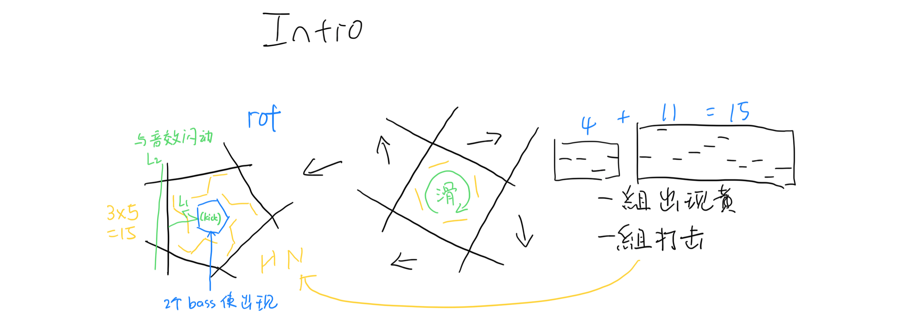
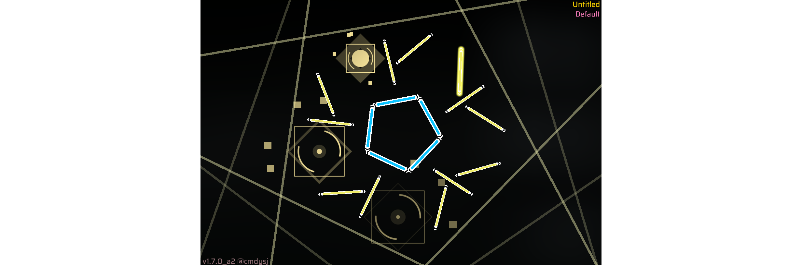
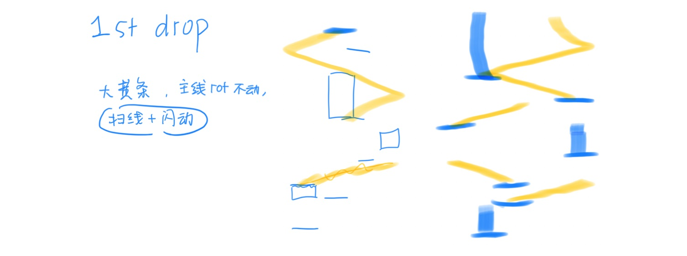
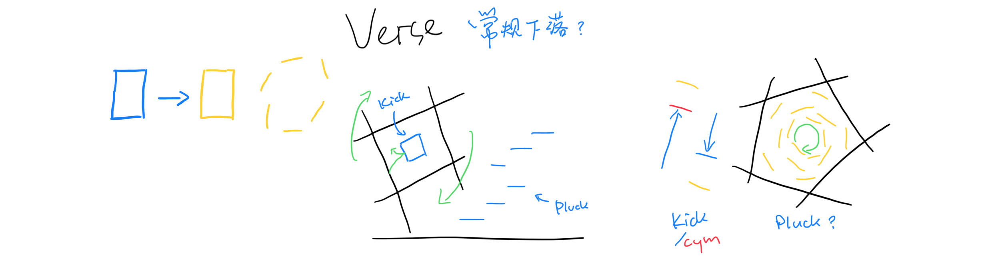
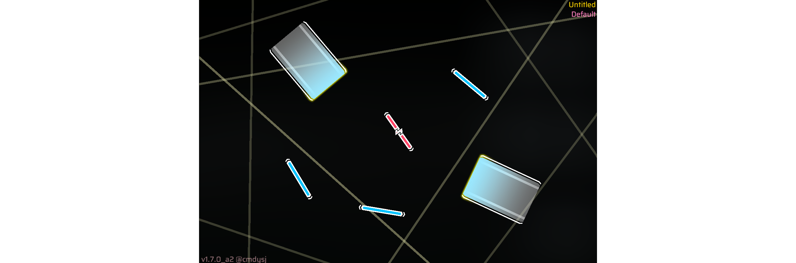
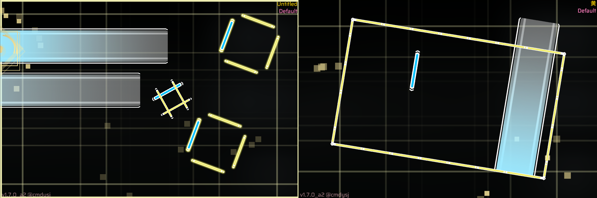
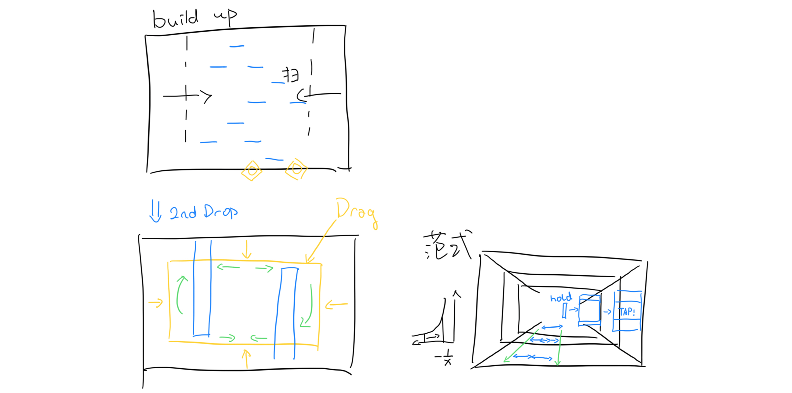
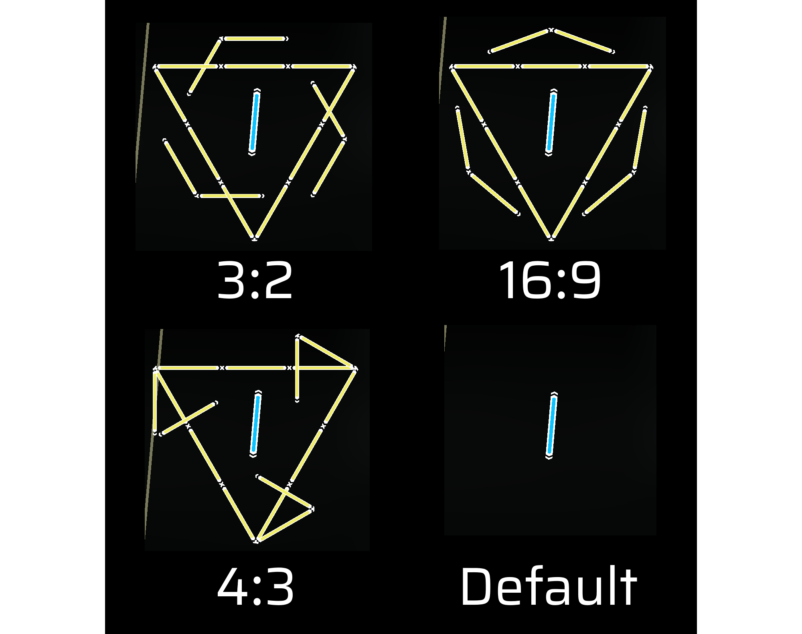
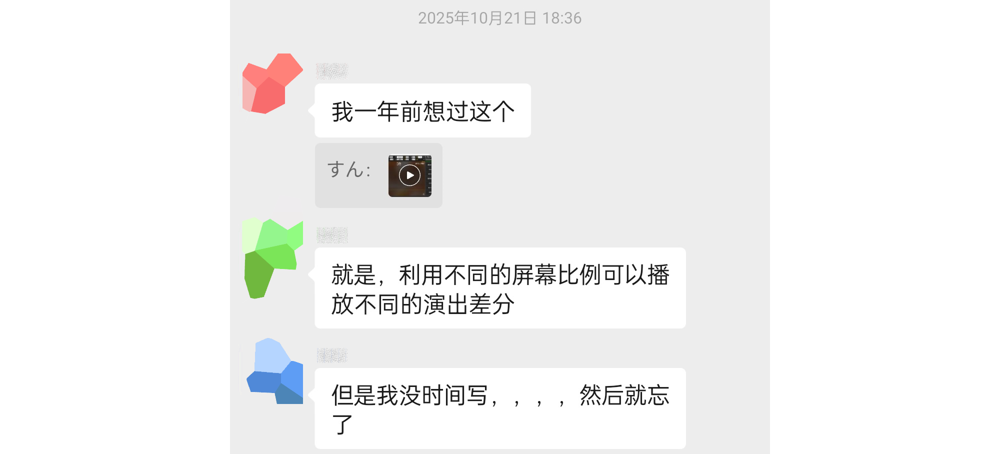

文章大概是半个月前写的，后来据直播反馈加了一点点点内容。

想到啥写啥（x）

本文会有非常非常多主观讨论，有错误还希望各位指正qaq

---

## 5th WJC后都在干些什么

去年八月往后，自己一直在谱面创作领域停滞不前。为忽然冒出的思路+喜爱曲子，不加思考的盲目开谱，导致废稿不断产出。我仍然热爱这些曲子，也喜欢大部分已经写完的段落，但终究再没有动力继续写下去。

那时忽然觉得，我所缺少的是写常规谱面的思路；说的难听就是写得少，如果没有点子就完全宕机，而不是能以某种公式写法填充。由此，促成了「I Can't Wait」与「Reinvent」两张公式谱，和一些速写纯配置的诞生（水成啥了，，）。

但，但感觉作品没什么意思，流水线的生产而已。

观察了一下自己以前比较有趣的谱面，几乎都是构好整张谱面基本思路后再下笔的：从一盘醋开始，逐渐把全曲填满。（其实「F1055」的醋就是那个四押侧落吼吼，初听就确定好的想法）所以，写公式谱时其实还在进行「Limen」与「???」的构思、创作与打磨，和一些去年初废稿的重置。

「???」本是0pj的预备投稿，于2026/1/29完工。但准备提交时感觉配置和部分效果还不尽人意，才决定将原本想投6th WJC的「Limen」写完。那时距截稿还有六天，能赶完已经是奇迹了 ;P

哦对，其实0pj还蹭了某神秘合作，可以猜猜是哪一张♪(´ω `)（说不定已经放过了;3

---

## Limen创作简谈

静屋Silentroom在25年10月末发布了新曲「Limen」，最让我头皮发麻的是buildup后2nd drop那种意想不到的平静，太厉害了。自此种下了写这谱的想法，把这种落差感用臀的元素表现出来。

嗯，其实很多思路都是上课开小差搓出来的（逃）所以留下了一些草稿

谱面创建于2025/12/9。

### Intro

其实最初最初的构想是四边形而不是五，但在发现一组pluck是15个时果断换成了五边形：更好看，更有记忆点，更重要的是 15 = 3 * 5 。回头继续一想，接下来的kick也刚好是5个，wocao怎么会有这么牛逼的巧合，便直接直接敲定五边形了。算是驱使我完整构思整张谱的第一盘醋了

本段的玩法设计是，跟着drag出现的顺序 顺时针滑动打击。虽说做不到禁止逃课，但跟着滑显然比糊上去更有趣吧qaq，所以还是建议正攻的嗯。

实现起来难度不大，当时还试着把黄替换成蓝键，但根本没法准确定位（我错了），就保留了原来的玩法。不过做出来还感觉屏幕两侧有点空，正好再加一层五边形来抓背景noise，而旋转的速度在表现噪声的音高。

提交前一天，谱面给[碳酸铜](https://space.bilibili.com/3546740311459845)同学初见试玩后发现，此处黄键顺序的记忆没有想象的容易（毕竟写谱都刻在心里了），于是添加了逐渐高亮来提示即将打击的按键。btw，在预览时发现phizone的默认皮肤与此处理的契合度远远高于官皮（要是放送也是这个皮就好了（x

### 1st Drop

感觉这个bass很适合拉大黄条，再加上想和后面产生设计差异（因为段落给人的情感也相对常规），就决定写点纯配置+扫线。

谱瘾犯了但电脑不在身边怎么办？写(物理意义上的✍)谱即可（x）

主线不转是因为这段bass给我一种严肃+冰冷的感觉，好像怎么转都不合适。

配置苦手啊...黄蛇位移其实削了不少来平衡前后难度、优化手感，但结果依旧不尽人意。其实个人觉得过度的躁动感一定程度上来自直播较大的黄键音量（相比limen音源）不过最终发布的版本也减少了部分黄条长度、位移与密度，和背景线的透明度；不过以目前的能力可能没法给大家呈现"静"的感觉了orz（谁能直接上手改改我配置qaq）

### Breakdown，Verse与Build-up

此时谱面推进大概停滞了半个月，初步方案实现不理想 + 想不到衔接 就先去写原定pj了。

hold爆开作为衔接的灵机一动和intro call-back的思路，在2nd drop初思路定下后才确定。

左侧初步尝试红蓝交替，但发现很难在右手画圈时处理左手flick。改成全tap后就几乎不需要花精力顾及左侧了，跟着节奏上下交替即可。如果上下+左右微移仍然无法协调，敲击中间通过垂判也都可以接到。

不过说实话，这应该是个人最不满意的段落了，相对无聊也不尽美观。因此那时才有了从一月初开始长达两个月的停滞期，不知道如何修改便暂时搁置了，反正6th WJC没想象的那么快来。（到最后也没改...没思路了，恳请各位来点建议吧orz..）

从这里开始决定改投「Limen」为0pj投稿。

pluck主旋律后出现了三个悠长、无kick的chord；又掐指一算，Phigros官方好像就刚好三首静屋参与制作的曲子（对，对吧？）。于是还原了三张谱面（Protoflicker / Random / Nhelv 的 IN）的特色一刻flashback一下来回应BOF赛事静屋的复出。（虽然Protoflicker并不是BOF曲，orz，走马灯致歉，orz）

Build-up段落原本打算每个kick闪一张静屋曲自制谱的特色一瞬，共16张。不过方案最后废弃，原因其一是工程量太大，更重要的是大段的走马灯会让玩家无聊且没有反馈，这东西真是多了就会恶心，，，更体现不出build-up逐渐上抬的强度，所以写了常规、渐快、逐渐加强的配置。

### 2nd Drop

陈醋。究竟怎么表现与build-up对比“意想不到的平静”，和两个乐句后上行音阶给听众的惊艳感？我觉得引入特化玩法和埋下意想不到的伏笔是不错的方案。浮现式，让强度与build-up对比下来明显掉了一截，而给玩家适应前的难度并不简单；玩家也几乎不可能预料那环绕屏幕的判定线框终有一刻会脱离边框的束缚。（不过直播的时候下面那条线被边框盖住了没有显示，怎么会这样）

不过回头来看这段的败笔还是不少的...多指切入其实还好因为弱化强度，但单touch双押难以察觉，方框段倒打的四个长条太长而导致双指难受，后又紧接无引导的多押长条...将会修复一部分问题，此外则是无法权衡处理改变带来的更多负面效果，例如不写单touch双押而是分开则那里的读谱压力将会是地狱级别。（我错了 我错了 已经尽量尝试排成好读的形状了（（）

最终方案肯定不是立刻成型的。最初的设想甚至比breakdown段都早出现 —— build-up就设好判定线框+下落音符，进入drop就挣脱边框。但这样段落思路过度单一且写起来真的很累，所以转而考虑先特化，呈现结果多次优化后才有了现在的效果。

哦对，为什么第四乐句回到常规配置了呢？因为四个下行四分lead把情感拉回了常规，特别像高潮之后贤者模式的感觉（?），所以个人觉得写回常规最契合乐曲走向。

### Outro

单纯看直播大概看不出来，此处随回响声出现的黄键图案会随不同的游玩比例变化：

终于把理论做了实现，好耶！

原理简而言之，不同比例下会使X与Y每个像素的距离不同，而线在旋转的坐标系上（父线）仍会保留数值拉伸。（专栏周末发

坏处是，若游玩比例不囊括在设计比例中（比如各品牌平板诡异的比例）差分将不会出现。影响大、长时间、无可替代的视觉效果还是不建议应用这个思路。相信各位能挖掘出更有趣的玩法w

（优化方式例如，上图比例同有的三角形其实可以作为default效果）

好巧不巧，[SulphurDXD](https://space.bilibili.com/678709909)*(某pj选手)*  在更早就发现了这个特性，并尝试将其应用到表演当中。更有趣、复杂的效果可以看看他的0pj投稿！

（终于找到实装的机会了说是 

哦对，其实最初有对12个kick做拆分的想法（3x4）但最后没有实装，是为了整点更简洁的视觉效果，希望玩家能把更多注意力放在黄键表演上。

谱面终于写完了！

### 其他小嘴碎

时间真的非常非常赶，距离截止时间7分钟才按上的提交。意想不到的是主办方多给了一个小时检查！因此加急修改了适配渲染音符大小版本，顺手修了几个bug（可能还有没发现的...），不过终归成功提交了！

因为phira不适配rpe1.7子父线，所以截稿后降回1.6适配了一下。不过还有部分适配没弄好，，周末应该能上传。

很多时候大脑会把目标效果脑补得太美好，真正写出来才知道究竟差在哪。

希望各位玩的开心!!(> <)

---

## 小结

不知道怎么结尾...如果有意见与建议是最好的!! 无论关于谱面、网站还是这篇文章

视频评论、私信、或直接在这里留言都可以!

感谢你看到这里~  :3

